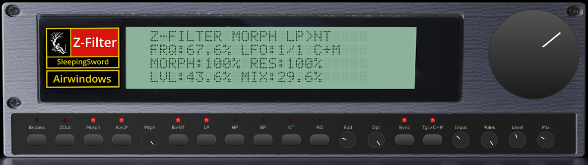
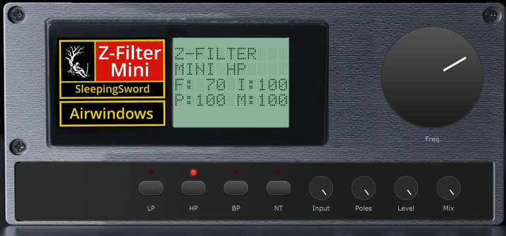
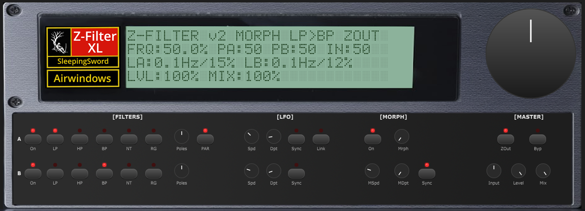

# Z-Filter (macOS)

A multi-mode morphing biquad filter audio plugin built with JUCE, based on the Airwindows Z-series filters by Chris Johnson. **Mac (Apple Silicon + Intel) universal binary builds** — VST3 and AudioUnit.

> For the Windows version, see [Z-Filter (Windows)](https://github.com/sleepingsw0rd/Z-Filter).



## All Versions (macOS)

| Z-Filter Mini | Z-Filter | Z-Filter XL |
|:---:|:---:|:---:|
|  |  |  |
| Single filter, no LFO, minimal UI | Single filter, single LFO, compact UI | Dual filter, dual LFO, morph, expanded UI |
| **[Download VST3](https://github.com/sleepingsw0rd/Z-Filter-Mac/raw/mini/Releases/Z-FilterMini-Mac-VST3.zip)** | **[Download VST3](https://github.com/sleepingsw0rd/Z-Filter-Mac/raw/main/Releases/Z-Filter-Mac-VST3.zip)** | **[Download VST3](https://github.com/sleepingsw0rd/Z-Filter-Mac/raw/v2-xl/Releases/Z-FilterXL-Mac-VST3.zip)** |
| **[Download AU](https://github.com/sleepingsw0rd/Z-Filter-Mac/raw/mini/Releases/Z-FilterMini-Mac-AU.zip)** | **[Download AU](https://github.com/sleepingsw0rd/Z-Filter-Mac/raw/main/Releases/Z-Filter-Mac-AU.zip)** | **[Download AU](https://github.com/sleepingsw0rd/Z-Filter-Mac/raw/v2-xl/Releases/Z-FilterXL-Mac-AU.zip)** |
| [Documentation](https://github.com/sleepingsw0rd/Z-Filter-Mac/tree/mini#readme) | *You are here* | [Documentation](https://github.com/sleepingsw0rd/Z-Filter-Mac/tree/v2-xl#readme) |

### Installation

- **VST3**: Unzip and copy `Z-Filter.vst3` to `~/Library/Audio/Plug-Ins/VST3/`
- **AU**: Unzip and copy `Z-Filter.component` to `~/Library/Audio/Plug-Ins/Components/`

Rescan in your DAW. All three versions can run side-by-side.

## Features

- **5 Filter Types**: Lowpass, Highpass, Bandpass, Notch, Region Gate
- **Filter Morphing**: Smoothly blend between two filter types (A and B) with independent type selection
- **Cascaded Biquad Architecture**: Up to 4 cascaded filter stages (12-48 dB/octave) controlled by the Resonance knob
- **LFO Modulation**: Tempo-syncable LFO with adjustable speed and depth, targeting Cutoff, Morph, or both
- **Z-Output Stage**: Optional Airwindows output processing stage for analog character
- **Input & Output Level Controls**: Input gain (-20dB to +20dB) drives the filter's saturation character; Output gain for final level adjustment
- **Opamp Modeling Stage**: Dual lowpass filters sandwiching a polynomial soft saturator, simulating bandwidth-limited analog op-amp behavior
- **Dot-Matrix LCD Display**: Real-time parameter readout in an HD44780-style display
- **Dry/Wet Mix**: Blend filtered and dry signals
- **Bypass**: Full signal bypass with LED indicator
- **Per-Sample Coefficient Smoothing**: Click-free parameter automation

## Controls

| Control | Function | Range |
|---------|----------|-------|
| **Frequency** (large knob) | Filter cutoff frequency | Full audio range |
| **Bypass** | Bypass all processing | On/Off |
| **ZOut** | Enable Z-Output stage | On/Off |
| **Morph** (enable) | Enable filter morphing between A and B types | On/Off |
| **A>LP** (Flt A) | Filter A type selector | LP/HP/BP/NT/RG (cycles on click) |
| **Mrph** (knob) | Morph blend between Filter A and B | 0% to 100% |
| **B>BP** (Flt B) | Filter B type selector | LP/HP/BP/NT/RG (cycles on click) |
| **LP / HP / BP / NT / RG** | Quick-set Filter A type | Lowpass, Highpass, Bandpass, Notch, Region Gate |
| **Spd** | LFO speed | 0.01 Hz to 20 Hz (free) or tempo-synced divisions |
| **Dpt** | LFO depth | 0% to 100% |
| **Sync** | LFO tempo sync | On/Off |
| **Tgt>CUT** (Tgt) | LFO modulation target | Cutoff / Morph / Both |
| **Input** | Pre-filter input gain | -20dB to +20dB (center = unity) |
| **Res** | Filter resonance / cascade depth | 1 stage (gentle) to 4 stages (steep) |
| **Level** | Post-filter output gain | 0 to +20dB |
| **Mix** | Dry/wet blend | 0% (dry) to 100% (wet) |

## Building

### Requirements

- macOS 11.0+ (Big Sur or later)
- Xcode 12.4+ with Command Line Tools (`xcode-select --install`)
- CMake 3.22+ (`brew install cmake`)
- JUCE 8.0.12 (fetched automatically via CMake)

### Build Steps

```bash
cmake -B build -G Xcode
cmake --build build --config Release
```

Builds universal binaries (arm64 + x86_64) by default.

Build artifacts:

- **VST3**: `build/ZFilter_artefacts/Release/VST3/Z-Filter.vst3`
- **AU**: `build/ZFilter_artefacts/Release/AU/Z-Filter.component`
- **Standalone**: `build/ZFilter_artefacts/Release/Standalone/Z-Filter.app`

With `COPY_PLUGIN_AFTER_BUILD` enabled, plugins are automatically installed to `~/Library/Audio/Plug-Ins/`.

## Project Structure

```
Z-Filter/
  CMakeLists.txt                         # Build configuration
  Source/
    PluginProcessor.h                    # DSP class declaration
    PluginProcessor.cpp                  # DSP implementation (filter, opamp, saturation)
    PluginEditor.h                       # GUI components (knobs, LEDs, LCD, buttons)
    PluginEditor.cpp                     # GUI layout and parameter binding
    AirwindowsReference/
      FilterReference.h                  # Original Airwindows algorithm documentation
  GUI/
    Screenshot-main.png                  # Plugin screenshot
    GUI-WithLogo1200.png                 # Background asset (runtime background)
```

## DSP Signal Flow

1. Input gain (`inTrim`) with hard clip to [-1, 1]
2. Frequency-dependent trim scaling
3. Up to 4 cascaded biquad filter stages (Transposed Direct Form II) with inter-stage clipping
4. DC-blocking highpass (~5 Hz)
5. Opamp stage: 15.5 kHz lowpass → polynomial soft saturation → 15.5 kHz lowpass
6. Output gain
7. Wet/dry mix blend
8. TPDF dither

## Credits

- **Filter algorithms**: Based on [Airwindows](https://www.airwindows.com/) ZLowpass2, ZHighpass2, ZBandpass2, ZNotch2 by Chris Johnson (MIT License)
- **Framework**: [JUCE](https://juce.com/) 8.0.12

## License

Filter DSP algorithms are derived from Airwindows code, licensed under the MIT License. See `Source/AirwindowsReference/FilterReference.h` for details.
