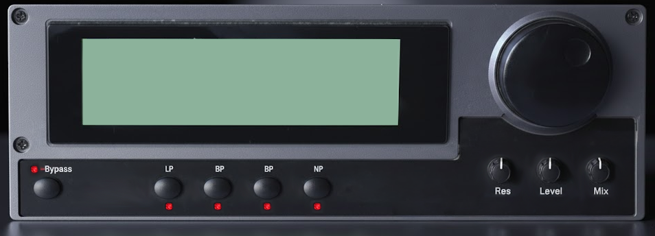

# Z-Filter

A multi-mode biquad filter audio plugin built with JUCE, based on the Airwindows Z-series filters by Chris Johnson.



## Features

- **4 Filter Types**: Lowpass, Highpass, Bandpass, Notch
- **Cascaded Biquad Architecture**: Up to 4 cascaded filter stages (12-48 dB/octave) controlled by the Resonance knob
- **Input & Output Level Controls**: Input gain (-20dB to +20dB) drives the filter's saturation character; Output gain for final level adjustment
- **Opamp Modeling Stage**: Dual lowpass filters sandwiching a polynomial soft saturator, simulating bandwidth-limited analog op-amp behavior
- **Dot-Matrix LCD Display**: Real-time parameter readout in an HD44780-style display
- **Dry/Wet Mix**: Blend filtered and dry signals
- **Bypass**: Full signal bypass with LED indicator
- **Per-Sample Coefficient Smoothing**: Click-free parameter automation

## Controls

| Control | Function | Range |
|---------|----------|-------|
| **Frequency** (large knob) | Filter cutoff frequency | Full audio range |
| **Input** | Pre-filter input gain | -20dB to +20dB (center = unity) |
| **Res** | Filter resonance / cascade depth | 1 stage (gentle) to 4 stages (steep) |
| **Level** | Post-filter output gain | 0 to +20dB |
| **Mix** | Dry/wet blend | 0% (dry) to 100% (wet) |
| **LP / HP / BP / NT** | Filter type selection | Lowpass, Highpass, Bandpass, Notch |
| **Bypass** | Bypass all processing | On/Off |

## Building

### Requirements

- CMake 3.22+
- C++17 compatible compiler (MSVC, GCC, Clang)
- JUCE 7.0.12 (fetched automatically via CMake)

### Build Steps

```bash
cmake -B build -S .
cmake --build build --config Release
```

Build artifacts:

- **VST3**: `build/ZFilter_artefacts/Release/VST3/Z-Filter.vst3`
- **Standalone**: `build/ZFilter_artefacts/Release/Standalone/Z-Filter.exe`

## Project Structure

```
Z-Filter/
  CMakeLists.txt                         # Build configuration
  Source/
    PluginProcessor.h                    # DSP class declaration
    PluginProcessor.cpp                  # DSP implementation (filter, opamp, saturation)
    PluginEditor.h                       # GUI components (knobs, LEDs, LCD, buttons)
    PluginEditor.cpp                     # GUI layout and parameter binding
    AirwindowsReference/
      FilterReference.h                  # Original Airwindows algorithm documentation
  GUI/
    GUI.png                              # Plugin screenshot
    GUI-NoControls.png                   # Background asset (no controls)
    GUI-NoControls-NoBigKnob.png         # Background asset (runtime background)
```

## DSP Signal Flow

1. Input gain (`inTrim`) with hard clip to [-1, 1]
2. Frequency-dependent trim scaling
3. Up to 4 cascaded biquad filter stages (Transposed Direct Form II) with inter-stage clipping
4. DC-blocking highpass (~5 Hz)
5. Opamp stage: 15.5 kHz lowpass → polynomial soft saturation → 15.5 kHz lowpass
6. Output gain
7. Wet/dry mix blend
8. TPDF dither

## Credits

- **Filter algorithms**: Based on [Airwindows](https://www.airwindows.com/) ZLowpass2, ZHighpass2, ZBandpass2, ZNotch2 by Chris Johnson (MIT License)
- **Framework**: [JUCE](https://juce.com/) 7.0.12

## License

Filter DSP algorithms are derived from Airwindows code, licensed under the MIT License. See `Source/AirwindowsReference/FilterReference.h` for details.
